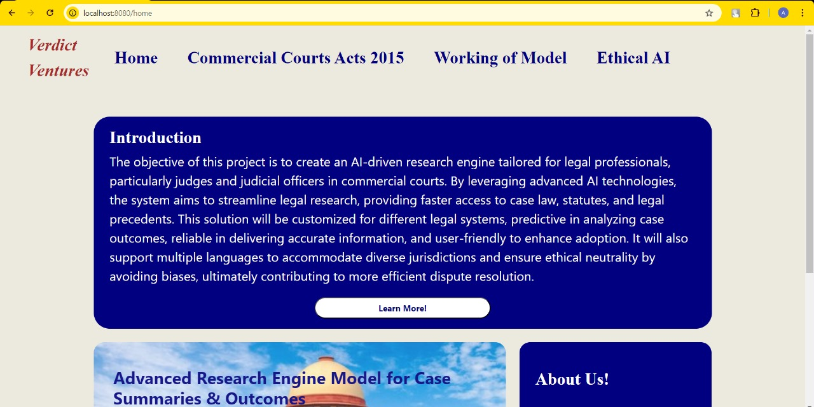
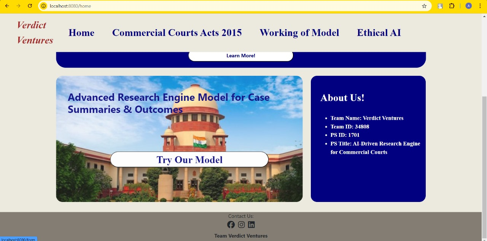
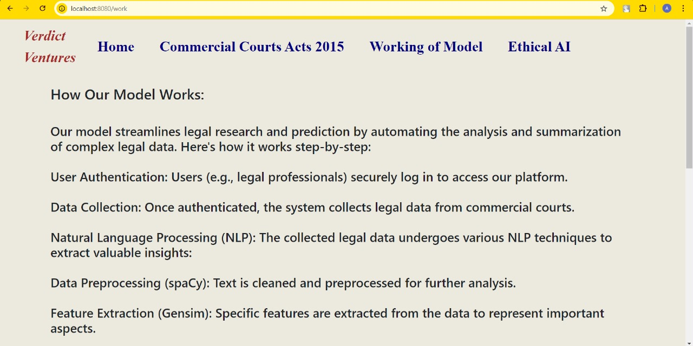
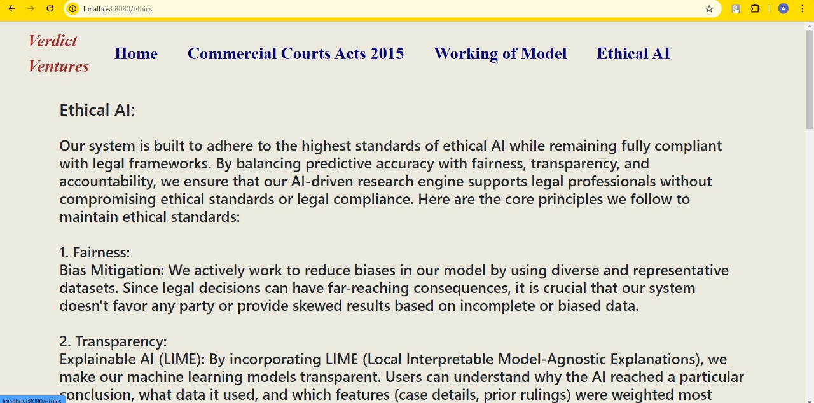

# Verdict Ventures

# AI-Powered Research Engine for Commercial Courts

## Project Overview
This project aims to develop an AI-powered research engine specifically designed for commercial courts. The engine automates and streamlines legal research processes, helping mitigate the backlog of cases in the judicial system. By leveraging advanced Natural Language Processing (NLP) models, the engine can efficiently extract, analyze, and summarize legal documents and court judgments.

## Key Features
- **Automated Document Analysis:** Quickly analyze and summarize legal documents and court judgments.
- **Relevant Case Law Retrieval:** Enable legal professionals to efficiently retrieve pertinent case laws.
- **Predictive Insights:** Generate predictive insights based on historical data from past cases.
- **User-Friendly Interface:** A simple and intuitive user interface for legal professionals.

## Current Progress
- **Frontend:** The frontend is complete and functional.
- **NLP and ML Model Development:** Ongoing work is focused on training and evaluation of the NLP and machine learning models to ensure accurate document analysis and insights.
- **Backend and Business Logic:** Development is in progress, ensuring smooth integration with the frontend and efficient processing of legal data.

  
## Screenshots

- **Homepage:**  
    
  _This is the homepage of Verdict Ventures, providing an overview of the platform and easy access to various features for legal professionals._  

    
  _Another view of the homepage showcasing additional features, including links to important sections like document submission._

- **Working Model:**  
    
  _This page explains how our AI model processes legal documents, from data extraction to providing insights, offering transparency on the workflow._

- **Ethical and Transparent AI:**  
    
  _This page highlights our commitment to ethical AI practices, ensuring fairness, transparency, and adherence to legal standards in all analyses._

- **Commercial Courts Act, 2015:**  
    
  _A detailed section displaying relevant laws from the Commercial Courts Act, 2015, integrated directly into the platform for easy reference by legal professionals._

  
## Technologies Used
- **Programming Languages:** Java, Python, JavaScript
- **Frameworks:** Spring Boot, React
- **NLP Libraries:** Spacy, Gensim
- **Database:** MongoDB
